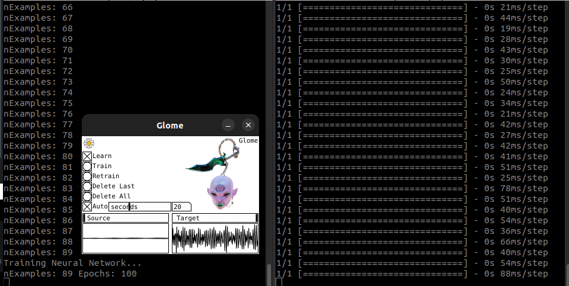

# Glome

Machine Learning Improviser VST3 Audio Effect.

requirements: python, pyliblo, keras, tensorflow, pure data.

How to use:

    - Launch train.py (python3 train.py);
    - Launch pred.py (python3 pred.py);
    - Launch Glome.vst3;
    - Feed audio to Glome (Learn is toggled on by default)
    - Train Neural Network (Auto train is toggled on by default)
